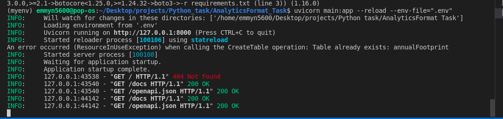
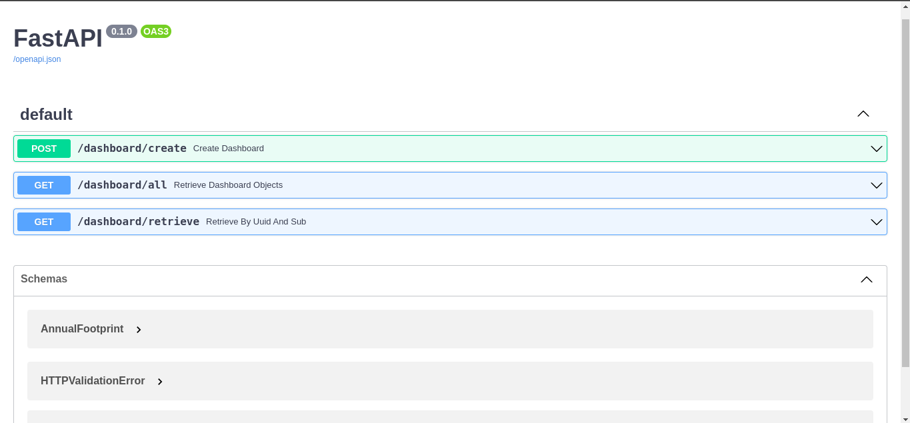
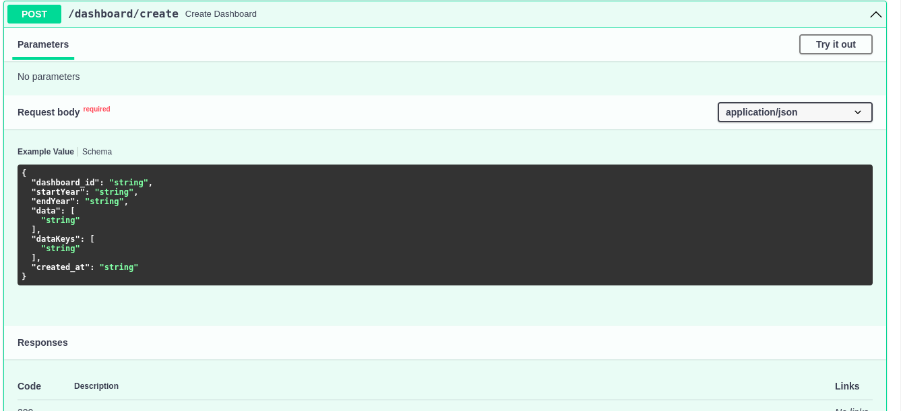
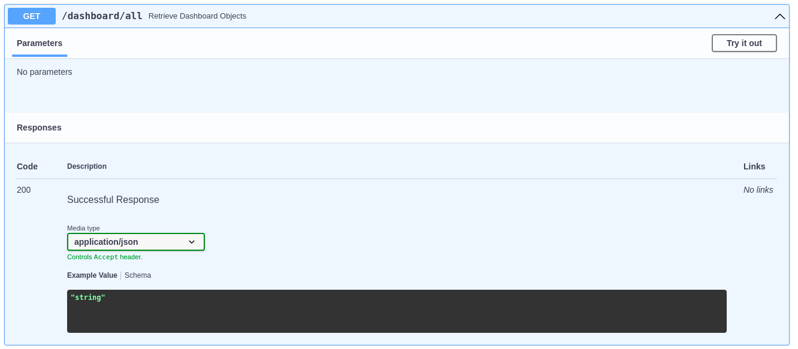
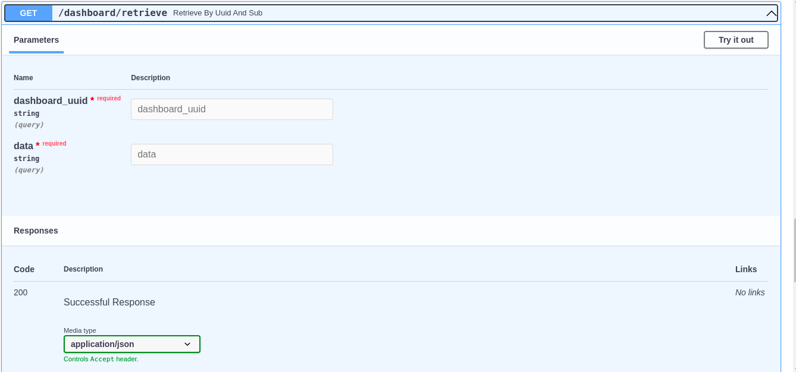

# task-fast-api

### Tasks

1. create new dynamodb table.

DynamoDB table:
- sub (Cognito generated uuid): Key
- dashboard_uuid: Sort
- data: dashboard obj

2. Create new api endpoint - '/dashboard'

- endpoint that can validate and store a dashboard object
- endpoint that returns a uuid list for available dashboard objects
- endpoint that returns a dashboard object referenced by its uuid and sub

## Getting started

clone the repository

```bash

https://github.com/Emmyn5600/AnalyticsFormat_Task.git

``` 
- Type `cd AnalyticsFormat_Task`.
- Create `.env file` in the root directory.
- Close the terminal and type `ctrl+shift+p` and then select interpreter.
- Open the terminal again and type `pip install -r requirements.txt`.
- Type `uvicorn main:app --reload --env-file=".env"` to run application.
 


Terminal

- 

Navigate to browser and type in the following address:

- http://127.0.0.1:8000/docs. you will see the following.

- 

POST endpoint: `POST/dashboard/create`

- 

GET all endpoint: `GET/dashboard/all`

- 


GET by uuid and sub endpoint: `GET/dashboard/retrieve`

- 


